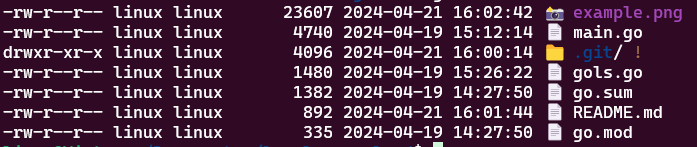

### Gols
---

This `Go` written project mimics the functionality of the Linux shell command `ls`, listing directory contents of files and directories. It offers additional features such as filtering by pattern, including hidden files, and sorting by modification time, file size, and name. 

#### Features

- Utilizes the `github.com/fatih/color` package for colorful output.
- Uses `github.com/AJRDRGZ/fileinfo` to extract user and group information.
- `main.go` contains the core functionality, while `gols.go` defines constants and types used in the program.

#### Flags

- `-p {string}`: Filter files by a pattern.
- `-a`: Include hidden files.
- `-n {int}`: Number of records to display.
- `-t`: Sort by modification time (oldest first).
- `-s`: Sort by file size (smallest first).
- `-r`: Reverse order while sorting.

#### Example

```bash
go run . -a -s -r
```

